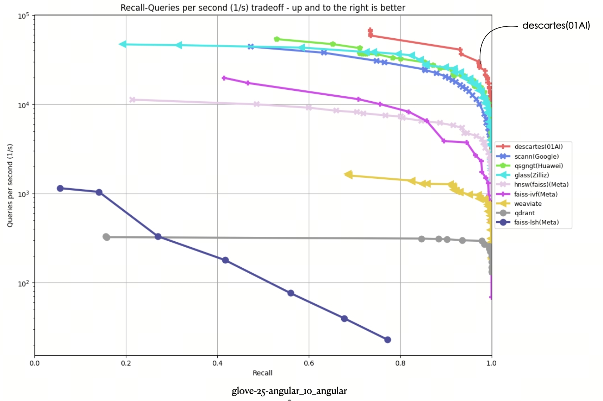
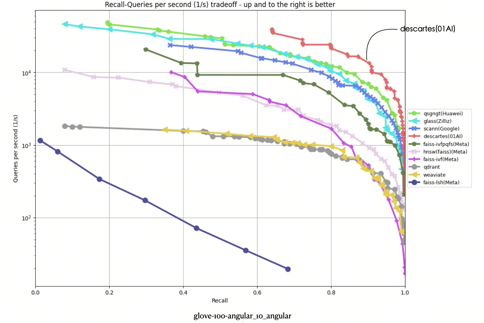
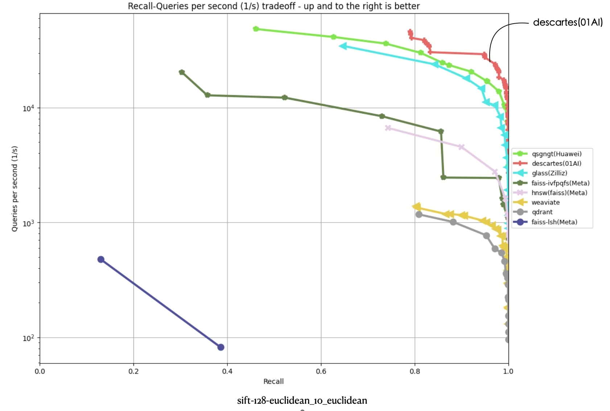
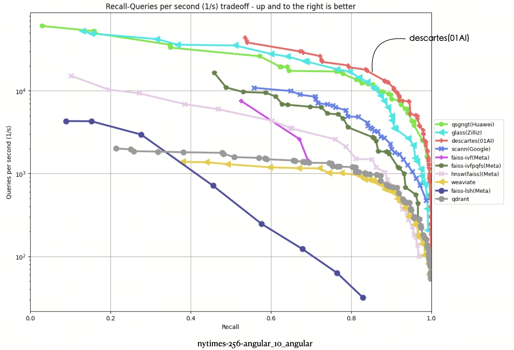
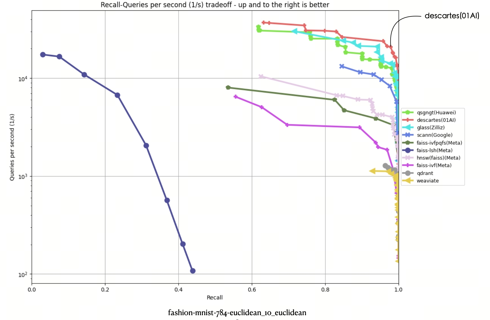
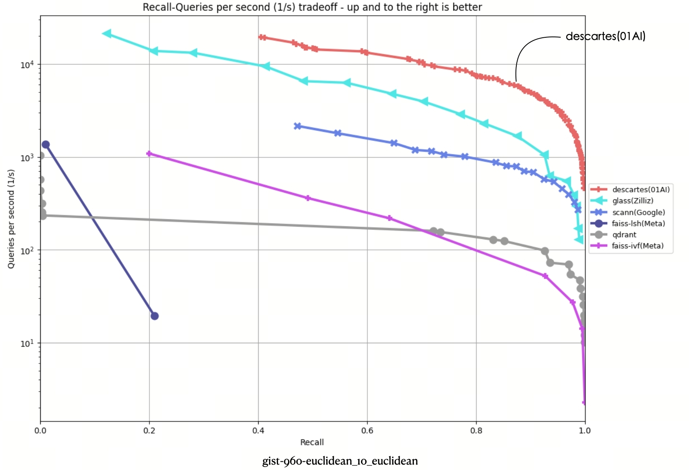
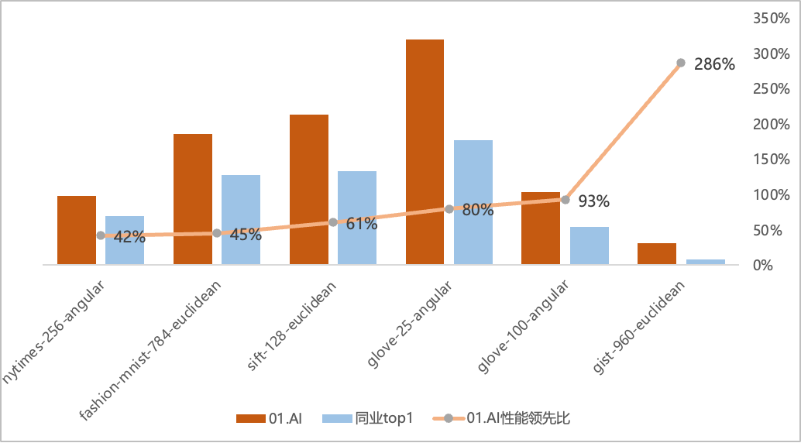
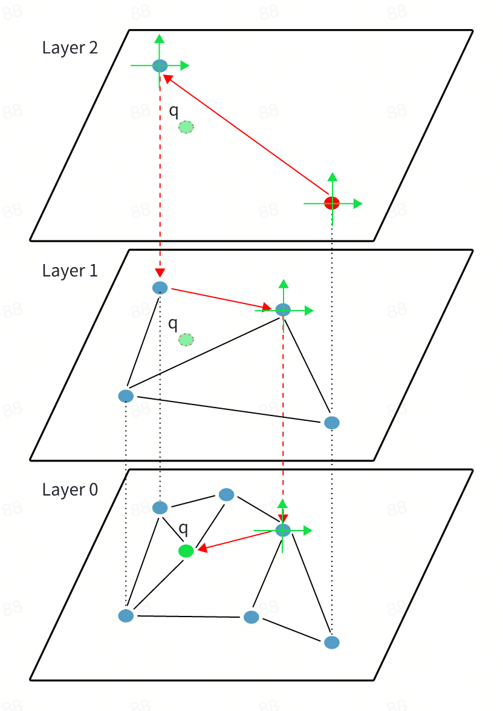

<div id="top"></div>

# Descartes
- [重要说明](#重要说明)
- [项目简介](#项目简介)
  - [优势](#优势)
  - [功能](#功能)
- [快速上手](#快速上手)
  - [系统要求](#系统要求)
  - [索引配置](#索引配置)
  - [接口说明](#接口说明)
  - [使用示例](#使用示例)
- [性能评测](#性能评测)
  - [召回与 QPS 结果对比](#召回与-qps-结果对比)
  - [QPS 结果对比](#qps-结果对比)
- [技术特性](#技术特性)
  - [全导航图](#全导航图)
  - [自适应邻居选择](#自适应邻居选择)
  - [连通性保障](#连通性保障)
  - [冗余邻居消除](#冗余邻居消除)
  - [索引结构优化](#索引结构优化)
  - [两级量化](#两级量化)
  - [索引构建优化](#索引构建优化)
- [选型考量](#选型考量)
- [更多资源](#更多资源)

# 重要说明

- [笛卡尔（Descartes）](https://github.com/01-ai/Descartes)是[零一万物（01.AI）](https://www.lingyiwanwu.com/)基于 RAG 的初步尝试。为了让各界关注 Descartes 的朋友尽早体验它的能力，零一万物即日起开放搜索内核 Binary 给大家使用，并提供免费商用。如需申请免费商用授权，请填写[表单](https://www.lingyiwanwu.com/vector-descartes)。
  
- 开放搜索内核 Binary 和发布现有 README 是第一阶段工作，近期会按序发布更多相关工具和技术内容，敬请期待。同时，零一万物会持续专注研发和分享，为开发者带来更好的技术和体验。
  
- Descartes 将用在近期即将正式亮相的 AI 产品中，未来也会基于需求情况，以友好地方式提供体验服务。

<p align="right"> [
  <a href="#top">返回顶部 ⬆️ </a>  ] 
</p>

# 项目简介

Descartes 是零一万物自研的向量数据库，其搜索内核通过全导航图、自适应邻居选择、两级量化等技术，既能保证**超高精度（大于 99%）**，又能实现**超高性能（千万数据量毫秒级响应）**。

## 优势

- 超高精度：基于多层缩略图和坐标系实现层间导航和图上方位导航，以及图连通性保障，实现精度大于 99%。相同性能下，精度大幅领先业内水平。
  
- 超高性能：高效的边选择和裁剪技术，千万数据量毫秒级响应。
  
## 功能

- 支持原始图和量化图。
  
- 支持流式构建，纯内存模式。后续将根据使用需求，可能考虑开放全量构建。
  
- 支持单精度浮点数。近期会开放支持更多数据类型（例如，双精度浮点数、int16 和 int8 向量类型）。
  
- 支持欧式和 Angular。近期会开放支持更多度量（例如，点积和汉明距离）。

<p align="right"> [
  <a href="#top">返回顶部 ⬆️ </a>  ] 
</p>

# 快速上手

## 系统要求

- Linux：Ubuntu 22.04 或更高版本
  
- gcc: 11.4.0
  
- cpuinfo flags：avx512f、mfma 和 mavx512bw
  
## 索引配置

> **注意**
>
> - 由于涉及性能调优的参数较多，本次暂时开放部分参数。后续将根据使用需求，考虑开放更多参数或支持自动调参。
> 
> - 如果不太熟悉参数配置，性能表现可能无法达到最优。如需获取快速技术支持，欢迎联系 yi@01.ai。
> 

```
# vector type: float
vector.global.vector_type = float

# dimension of vector:must less than maximum value of uint16_t
vector.global.dimension = 128

# metric type: l2, square_l2, ip
vector.global.metric_type = square_l2

# maximum document count
vector.global.max_doc_cnt = 1000000

# index directory
vector.global.index_dir = /home/ubuntu/indexes

# build result count:optional, default is 400
vector.fng.build.build_res_cnt = 500

# maximum neighbor count:optional, default is 64, can't bigger than 255
vector.fng.build.max_neighbor_cnt = 32

# search result count:optional, default is 400
vector.fng.search.search_res_cnt = 40

vector.pqg.pq.subquantizer_cnt = 128
```

## 接口说明

```c++
class GraphIndex {
public:
    GraphIndex() = default;
    virtual ~GraphIndex() = default;

public:
    // index init from config file
    virtual int Init(const std::string &configFilePath) = 0;
    
    // add vector to index
    virtual int AddVector(const void *vector, size_t bytes, uint64_t key) = 0;
    
    // search vector in index with context
    virtual int Search(const void *vector, size_t bytes, SearchContext &context) = 0;
    
    // refine the index. Will quantize the index if  quantize is true
    virtual int RefineIndex(bool quantize) = 0;
    
    // dump index
    virtual int Dump() = 0;
    
    virtual uint32_t GetCurrentDocCnt() const = 0;
};

// create index
std::shared_ptr<GraphIndex> CreateGraphIndex();
```

## 使用示例

```c++
#include <vector>
#include <string>
#include <assert.h>

#include "descartes_index.h"

using namespace descartes;

int main()
{
    auto index = CreateGraphIndex();
    std::string file("./cfg");
    assert(index->Init(file) == 0);
    int dims = 128;
    int cnt = 100000;
    std::vector<float> vecs(dims * cnt);
    for (size_t i = 0; i < vecs.size(); ++i) {
        vecs[i] = i;
    }


    for (int i = 0; i <cnt; ++i) {
        int ret = index->AddVector(vecs.data() + i * dims, sizeof(float) * dims, i);
        assert(ret == 0);
    }
    assert(index->RefineIndex(false) == 0);

    SearchContext ctx;
    ctx.topk = 10;
    ctx.searchResCnt = 20;
    for (size_t i = 0; i < 100; ++i) {
        int ret = index->Search(vecs.data() + i * dims, sizeof(float) * dims, ctx);
        assert(ret == 0);         
    }
    assert(index->Dump() == 0);
}
```

<p align="right"> [
  <a href="#top">返回顶部 ⬆️ </a>  ] 
</p>

# 性能评测

- 当前，ANN-Benchmarks 是全球范围内最权威和常用的向量检索技术性能评测榜单之一。
  
- 本次测试零一万物严格还原 ANN-Benchmarks 官方测试条件，包括使用了相同的硬件（AWS 的 r6i.16xlarge）及参数（并发为 31 且禁用了超线程 ），在离线状态下完成。如需还原 ANN-Benchmarks 测试，参阅[还原步骤](./ann-algo/ann-benchmarks.md)。
  
- 本次测试时间为 2024 年 3 月 1 日。
  
## 召回与 QPS 结果对比

从 ANN-Benchmarks 测试结果可以看出，Descartes 登顶 6 份数据集评测第一名，比之前榜单上同业第一名有显著性能提升，部分数据集上的性能提升甚至超过 2 倍以上。
  
本次测试 6 份评测数据集涵盖 6 大数据集：glove-25-angular、glove-100-angular、sift-128-euclidean、nytimes-256-angular、fashion-mnist-784-euclidean、gist-960-euclidean。

其中，横坐标代表召回，纵坐标代表 QPS（每秒内处理的请求数）。**曲线位置越偏右上角意味着算法性能越好**。可以看出，Descartes 在 6 项数据集评测中都处于最高位。
  
- glove-25-angular 数据集



- glove-100-angular 数据集



- sift-128-euclidean 数据集



- nytimes-256-angular 数据集



- fashion-mnist-784-euclidean 数据集


  
- gist-960-euclidean 数据集



## QPS 结果对比

- QPS 是衡量信息检索系统（例如，搜索引擎或数据库）查询处理能力的重要指标。

- 在原榜单 TOP1 基础上，Descartes 搜索内核实现了显著性能提升，部分数据集上的性能提升超过 2 倍以上，在 gist-960-euclidean 数据集维度更大幅领先榜单原 TOP1 286%。

- 下图是 90% 召回时 QPS 对比。


  
<p align="right"> [
  <a href="#top">返回顶部 ⬆️ </a>  ] 
</p>

# 技术特性

Descartes 搜索内核在处理复杂查询、提高检索效率以及优化数据存储方面相比业界拥有显著的比较优势。

RAG 向量检索主要解决的问题 |Descartes 技术特性|业界现状
---|---|---
减少检索考察的候选集<br>（通过建立某种索引结构）|[全导航图](#全导航图) <br><br>自研图上坐标系导航，既能保证**超高精度（大于 99%）**，又能实现**超高性能（千万数据量下毫秒级响应）**。|通过哈希、KD-Tree、VP-Tree 或随机等方式，导航效果不够精确，裁剪力度不够。
（同上）|[自适应邻居选择](#自适应邻居选择) <br><br>首创自适应邻居选择策略，较大提升了 RAG **向量检索性能**。|没有或者简单的边选择，容易陷入局部最优，潜力挖掘不充分。
降低单个向量计算的复杂度 | [两级量化](#两级量化)<br><br>相比于传统 PQ 查表，**性能大幅提升 2-3 倍**。|简单 PQ 量化，在量化本身，以及索引存储上没有特别处理，无法更进一步发挥硬件能力。

## 全导航图

向量数据库中最核心的技术是「向量检索技术」。随着向量检索技术的不断发展，实践已经证明「基于图的最近邻算法」在检索的精度和性能上脱颖而出，成为了向量检索的主流技术。

因此，零一万物自研了「全导航图」，其本质也是图算法的一种。全局多层缩略图导航技术，图上坐标系导航，既能保证超高精度，又能实现超高性能。

<p align="center">
  
</p>

如上图所示，「全导航图」由 2 层次导航组成：

- 第 1 层次导航：与 HNSW 一样，类似传统的跳表思想，通过逐层缩略全局图来实现导航效果。
  
- 第 2 层次导航：体现在每一层图上，通过以每个节点为坐标原点，其邻居通过坐标系来分组存储，考虑不同的数据分布情况，根据配置可以有不同的分组方式。例如：
  
  - Layer 2：检索时从 Layer 2 的红色点作为入口点开始检索，查询向量 q 参照红色节点建立的坐标系可以快速定位需要考察的邻居组，从而过滤掉大量不必要的计算。
  
  - Layer 1：在当前层没有更近的节点时，检索进入下一层（Layer 1）继续遍历。
  
  - Layer 0：在进入到 Layer 0 后，检索逻辑和上层图稍有不同。上层图的目标是找好 Layer 0 上的入口点，加速检索的收敛，而在 Layer 0 的目标是找到真实的最近邻。考虑到一些特殊情况（例如，和你不在一个组内的节点也可能是你最终的最近邻），因此需要做一些额外处理。所以，先在全局最近的节点周边探测，往外扩后可以继续参考坐标系来定位需要计算的邻居组。

## 自适应邻居选择

零一万物自研的「自适应邻居选择策略」，突破了以往全依赖真实 topk 或固定边选择策略的局限，使每个节点可以根据自身及邻居的分布特征，动态地选取最佳邻居边，更快收敛接近目标向量。

- 通常图构建好以后，我们用一个节点其邻居边与这个节点真实的 topk 的重合度来描述图的质量。
  
- 但实践表明，如果我们以真实 topk 作为邻居边，不仅构建的时间代价巨大，而且检索效果也不是很理想，反而 RNG 类算法具有更好的检索性能，这是因为他们普遍加入了「邻居边选择策略」。
  
- 目前主流的「邻居边选择策略」有两类：基于「边长短」来决定边保留（例如，HNSW、NSG、NGT 等）或根据「角度」来决定是否保留边（例如，NSSG）。
  
- 从本质上讲，这两种方法都是让图的延展性更好，从而获得更佳的检索性能，但他们普遍的一个问题是没有考虑每个节点及其邻居的分布，一刀切地采用相同策略。
  
- 在实践中，向量空间必然存在各种不同的空间分布。例如，有的密集分布在一起，这时需要加大边间隔选择；有的偏向明显，这时不能只选择某个集中方向的邻居边。
  
- 因此，零一万物自研「自适应邻居边选择」策略，让每个节点能够根据自身和邻居的相对分布，来决策应该选择哪些邻居作为最终的邻居边，既能保证足够延展性，避免陷入局部最优；又能根据边强度裁剪多余边，避免向量被反复探测。
  
## 连通性保障

- 通常而言，在较大向量数据集上，构建好的图难免会有孤立的节点。例如，整个向量空间被切分为了很多互相不联通的子图，甚至很多节点根本没有入边，成为真正的孤点。        
  
- 如果不对图做任何处理，相互割裂的子图，必然导致检索性能很差，检索精度也无法保障。
  
- 因此，零一万物开发了图的连通性保障策略，从全局入口点开始，遍历所有节点。当发现有孤立点时，会从图上建立一条边到孤立点，同时保障被替换的点的入度必须满足一定的阈值，否则容易导致按下葫芦浮起瓢，最终无法实现连通性保障。
  
## 冗余邻居消除

- 在连通性保障措施后，图相对就比较完整了，但还存在一个问题：里面存在较多的冗余信息，即对一个节点而言，「它的邻居边」和「它邻居的邻居边」有大量重合。
  
- 在检索的过程中，如果检索路径遍历这个节点和它的一个邻居节点，由于这两个节点的邻居边存在较大重复，因此，最终遍历两个节点考察的向量数其实没有太多扩展。此时，为了更高的召回，需要考察更多的节点，会导致性能恶化。
  
- 为了消除冗余邻居，零一万物根据邻居边相对于当前节点的强度，来裁剪冗余边。例如，假设有 V1、V2 和 V3 三个节点，通过 V1 的邻居表能遍历到 V2。
  
  - 如果 V3 同时是 V1 和 V2 的邻居，那么没有必要让 V1 和 V2 都保留作为 V3 的邻居。
  
  - 如果 V3 离 V2 更近，由于通过 V2 可以遍历到 V3，那么在 V1 邻居表中，可以直接裁剪 V3，而裁掉的 V3 空缺可以填入更有用的邻居边。这样既不会破坏连通性，也能降低 V1 和 V2 的信息冗余度。           

## 索引结构优化

- 传统图方法在索引结构上都没有特意布局，大多算法只是简单利用 prefetch 指令来提升性能。
  
- 为了充分利用硬件特性，零一万物根据检索过程的 workload，按照访问的顺序排列索引结构，尽可能让缓存命中率提升，让消耗的内存带宽都能物尽其用。各种数据结构的大小都贴近 2 的指数幂大小，从而让乘法操作转化为移位操作。
  
- 内存尽可能按缓存行大小对齐，防止跨越缓存行导致多余的访问。
  
- 多层图的全局入口点使用全局向量空间的质心，减少随机选择可能造成的过度偏离，避免增加无谓的计算量。以入口点为基础重新排列向量布局，使得经常访问的向量能够在缓存中命中，从而进一步提升缓存命中率。

## 两级量化

零一万物通过两层量化，将 float 类型量化到 int8，大幅减少检索过程中需要的带宽和计算量。

同时，列式存储充分利用 avx512 的单指令多数据特性，进一步发挥硬件能力。相比传统 PQ 查表，性能得到大幅提升到 2-3 倍。

## 索引构建优化

- 当前，业内有 2 类常见索引构建方法：
  
  - 第 1 类：类似 HNSW 的传统流式构建向量索引。每次构建相当于一次查找过程，随着图中向量不断增加，索引构建会越来越慢，根本原因是每次向量的加入都是一次全新的独立过程，导致了很多重复计算。
  
  - 第 2 类：nn-descent 方法。通过不断地迭代，较好地共享了之前的计算结果，但在多线程的并发度上有些瑕疵，大量的上锁和内存拷贝导致效率没有充分发挥。
  
- 为了加快构建速度，零一万物研发了全量迭代方法来构建索引，通过标记邻居边状态，并充分利用好局部性原理，大幅提高了索引的并发构建效率。

<p align="right"> [
  <a href="#top">返回顶部 ⬆️ </a>  ] 
</p>

# 选型考量

零一万物在研发 Descartes 搜索内核时，学习和参考了多种经典思路。

- HNSW。在设计全导航图的第一层时，零一万物参考了 HNSW 的思路。为了更好地提升导航效果，Descartes 同时在「入口点选择节点图层的投影」和「邻居边选择」采用了不同的策略，并增加了连通性保障、冗余邻居消除等方法，大幅提高了检索效果。
  
- NGT。在早期研究阶段，零一万物参考过 NGT 的思路，但在实际测试过程中，但发现它有不少问题。例如，由于它是树 + 图的组合方式，邻居表可能无限膨胀，这会造成建索引时对内存需求过大、且构建十分耗时，导致 gist-960-euclidean 数据集无法在 ANN-Benchmarks 运行环境上稳定地建出索引。
  
- ScaNN。Google 推出 ScaNN 时，它的关键词是一种新的量化方式（各项特异量化），擅长解决 MIPS 问题。考虑到工程实现的有效性，零一万物选择了更高效的两级量化方式。

<p align="right"> [
  <a href="#top">返回顶部 ⬆️ </a>  ] 
</p>

# 更多资源

- [零一万物开放笛卡尔向量数据库搜索内核，免费商用](https://mp.weixin.qq.com/s/3-_KUz7JCTwDbpr1-B5sdA)

<p align="right"> [
  <a href="#top">返回顶部 ⬆️ </a>  ] 
</p>